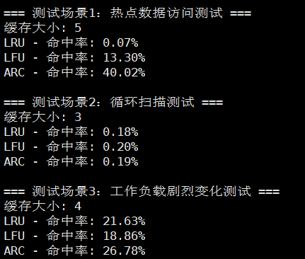

# kamaCache
【代码随想录知识星球】项目分享-cache的实现（LRU，LFU，ARC）

## 项目介绍
本项目使用多个页面替换策略实现一个线程安全的缓存：
- LRU：最近最久未使用
- LFU：最近不经常使用
- ARC：自适应替换

对于LRU和LFU策略，我在其基础的缓存策略上进行了相应的优化，例如：

- LRU优化：
    - LRU分片：对多线程下的高并发访问有性能上的优化
    - LRU-k：一定程度上防止热点数据被冷数据挤出容器而造成缓存污染等问题

- LFU优化：
    - LFU分片：对多线程下的高并发访问有性能上的优化
    - 引入最大平均访问频次：解决过去的热点数据最近一直没被访问，却仍占用缓存等问题

## 编译
创建一个build文件夹并进入
```
mkdir build && cd build
```
生成构建文件
```
cmake ..
```
构建项目
```
make
```
如果要清理生成的可执行文件
```
make clean
```

## 运行
```
./main
```

## 测试结果
不同缓存策略缓存命中率测试对比结果如下：
（ps: 不同测试用例呈现结果不同，不可一概而论。）

